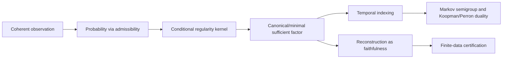

# Observational Priority and the Reversal of Explanatory Order

## See also

- `novelty_audit.md` — condensed ranked claim-by-claim audit
- `field_by_field.md` — detailed per-audience reception assessment
- `historical_placement.md` — historical ancestors and literature neighborhoods

## Executive summary

The programme is best understood neither as a wholesale replacement of classical probability/dynamics nor as mere rhetoric. Its strongest mathematical shot is **Part I**: if Collective Exhaustion (CE) really gives a new if-and-only-if criterion for when coherent finite-level observational data force a unique σ-additive probability, then that is not standard Kolmogorov-extension boilerplate. It sits closer to a new extension/admissibility theorem at the intersection of projective extension, Boolean-algebraic measure theory, and the finitely-vs-countably additive fault line studied by Andrey Kolmogorov, Alfred Horn, Alfred Tarski, John L. Kelley, Dorothy Maharam, Kôsaku Yosida, and Edwin Hewitt.

The programme’s **main conceptual originality** is the reversal of order: coherent observation → probability → conditional regularity → canonical factor → dynamics as a temporal specialization → reconstruction as faithfulness → certification. That reversal is unusual as a synthesis, but most of its later stages use standard mathematics already present in disintegration theory, sufficiency, Blackwell comparison, Koopman/Perron operator theory, Takens/embedology, and observable-state models such as OOMs, PSRs, and computational mechanics.

So the fair verdict is: **Part I may contain the genuinely new theorem; Parts II–III are more plausibly a forceful reorganization and unification under observational priority**. That is still a serious contribution. But if the work is sold as though it discovered conditional kernels, sufficient factors, Koopman duality, or state reconstruction ex nihilo, experts will push back immediately and correctly.

The strongest conceptual re-read is the reconstruction claim: in the classical delay-embedding tradition, one starts with a primitive state space and asks whether an observation map embeds it; here, one instead starts from observable law and asks whether the canonical observable factor is faithful. That is not the standard Takens framing, although it is mathematically adjacent to observability, sufficiency, causal states, and predictive representations.

The most vulnerable claims are the Stone-space interpretation of CE, the “κ_Q is already there” claim, the Cantor-example rhetoric, and any forecast of observational Lyapunov exponents if those are advertised before there are definitions and theorems. Those are the places where “new language for standard theory” objections will land.

## Historical trajectory

Classical probability begins from extension and consistency. Kolmogorov’s extension theorem says that a consistent family of finite-dimensional distributions yields a process measure on a canonical path space; in other words, once finite marginals satisfy the appropriate compatibility relations, existence of a global probability measure follows. The canonical modern picture is thus: specify finite-dimensional laws first, then extend to a global law on cylinders. That is the baseline against which your Part I is to be judged. CE is potentially new only if it is **not** a disguised restatement of classical compatibility plus a routine extension theorem, but instead an exact criterion for when coherence over a directed observational system blocks purely finitely additive escape and forces σ-additivity.

The pressure point here is old. Abstract measure theory and Boolean-algebraic foundations long ago separated finitely additive from countably additive regimes. Stone duality, via Marshall H. Stone’s 1936 representation theorem, turns Boolean algebras into clopen algebras of ultrafilter spaces; Horn–Tarski and Kelley looked for internal structural conditions under which a Boolean algebra supports a strictly positive measure; Maharam and then Talagrand showed how subtle the algebraic characterization problem really is; and Yosida–Hewitt proved the canonical decomposition of a bounded finitely additive measure into a countably additive part and a purely finitely additive part. This is exactly the historical neighborhood in which CE lives. If CE gives an exact criterion for preventing the purely finitely additive component, that is mathematically meaningful and historically well-placed.

The logical side matters too. Haim Gaifman’s work on measures in first-order calculi and later probability-logical work by Ronald Fagin, Joseph Y. Halpern, and Nimrod Megiddo made precise something your programme wants to leverage: finite additivity is axiomatically easy, while countable additivity is not first-order expressible in the ordinary finitary languages used there. So a claim that CE is “irreducible to first-order structural conditions” is not historically alien at all; it slots neatly into a known expressibility barrier. What may be new is applying that insight to a concrete observation-extension theorem.

Once a genuine probability measure exists, the next historical line is conditional structure. Kolmogorov already framed conditional probability as a central concept; by the time of Rohlin/Rokhlin disintegration and later expositions such as Chang’s “conditioning as disintegration,” the modern measure-theoretic lesson was clear: conditional laws are not primitive extra structure if the ambient measurable setting is nice enough; they are kernels extracted from the global measure. That is the exact mathematical backdrop for your “κ_Q is read off rather than postulated” claim. The novelty there is not the kernel itself. It is the insistence that the kernel is explanatory prior to time-indexed dynamics.

Statistics gave a parallel story in the language of sufficiency. Bernard O. Koopman’s paper on sufficient statistics, together with the Fisher–Neyman tradition, made clear that a sufficient statistic/factor is the right quotient when one wants to preserve all parameter-relevant information. David Blackwell’s comparison-of-experiments programme then abstracted this further: informativeness can be ordered by the possibility of garbling, and sufficiency can be understood without privileging hidden states. Your canonical factor Q* sits closest to this tradition, though you are applying it to observable organization rather than to parametric inference in the narrow sense.

The mainstream stochastic-process tradition, crystallized in Joseph L. Doob and later textbooks such as Pierre Brémaud, typically starts with a filtration or a Markov kernel and treats temporal information flow as primitive. That is exactly what your programme is turning around. It is not abolishing filtrations or semigroups; it is relocating them downstream from observable probability and conditional regularity.

The operator-theoretic branch runs through Koopman and transfer operators. Koopman’s 1931 paper starts with a transformation/dynamical law and then studies its induced linear action on observables. In contemporary language, the Koopman operator is composition on observables and the Frobenius–Perron operator is its measure-evolution counterpart. Your Part II shares the observable emphasis but breaks with the classical assumption that the underlying dynamics T is primitive.

The reconstruction branch begins with Floris Takens and is broadened by Tim Sauer, James A. Yorke, and Martin Casdagli. In that literature, the central question is whether a generic observable and a sufficient number of delays yield an embedding of the underlying attractor or state set. Your move from “embedding problem” to “faithfulness of the canonical factor” is therefore a real conceptual break in framing, even though it remains close to observability and injectivity questions familiar in that literature.

Finally, the nearest “observable-first” analogues are not in classical ergodic theory at all but in machine learning and complex-systems work: OOMs, PSRs, and causal-state/computational-mechanics models. Herbert Jaeger’s OOMs characterize discrete stochastic processes in terms of observable operators; Michael L. Littman, Richard S. Sutton, and Satinder Singh’s PSRs model state as predictions of future observable tests; and James P. Crutchfield with Cosma Rohilla Shalizi treat causal states as minimal predictive partitions. These do not prove your theorems, but they show that the general instinct—privilege the predictive/observable quotient over hidden state—is already a live and respected one.

This diagram is not standard textbook ordering. The standard literature usually goes from probability space plus dynamics/filtration to kernels, factors, and embeddings; your programme pushes probability and conditional structure upstream and treats time and reconstruction as specializations. The individual arrows are classical; the **ordering of arrows** is the unusual part.

## Literature neighborhoods and order of explanation

| Neighborhood | Key references | Best relation |
|---|---|---|
| Kolmogorov extension / projective systems | Kolmogorov 1933; Daniell–Kolmogorov formulation of consistency and canonical path measure. | **Extends and departs**: same global problem of extending coherent finite data, but not along a standard time-indexed projective family. |
| Finitely vs countably additive probability | Yosida–Hewitt 1952 decomposition; Maharam 1947; Talagrand 2006/2008; Horn–Tarski 1948; Kelley 1959. | **Extends and unifies**: CE is positioned as an exact criterion for blocking purely finitely additive escape. |
| Stone duality / Boolean algebraic foundations | Stone 1936; ultrafilters as 0–1 finitely additive measures; compactification viewpoint. | **Translates**: the Stone-space reading is a classical dual-language reinterpretation of additive pathologies. |
| Probability logic / non-first-order expressibility | Gaifman 1964; Fagin–Halpern–Megiddo 1990; related first-order probability logics. | **Extends**: the irreducibility claim fits this tradition; the novelty would be tying it to CE and query systems. |
| Disintegration / conditional expectation / sufficiency | Kolmogorov on conditional probability, Chang 1997, Simmons 2012, Koopman 1936, Blackwell 1951/1953. | **Translates and reorders**: standard kernels and sufficient factors, but recast as consequences of observable probability rather than as data supplied with the model. |
| Stochastic processes / filtrations / Markov kernels | Doob 1953; Brémaud 1999/2020. | **Departs in explanatory order**: keeps the mathematics, rejects the usual conceptual priority of filtration/time. |
| Koopman / Perron–Frobenius | Koopman 1931; transfer-operator tradition. | **Translates**: observables remain central, but now operator structure is downstream from observable regularity rather than downstream from a primitive T alone. |
| Takens / delay embeddings / embedology | Takens 1981; Sauer–Yorke–Casdagli 1991. | **Departs conceptually**: not “when does h embed M?” but “when is the canonical observable factor faithful?” |
| OOMs / PSRs / computational mechanics | Jaeger 2000; Littman–Sutton–Singh 2001/2002/2004; Shalizi–Crutchfield 2001. | **Unifies**: these are the closest living relatives of an observable-first stance. |
| Finite-sample reconstruction / certification | Stable Takens results; geometry-preserving delay maps; embedding-delay robustness literature. | **Potentially departs**: most existing work certifies or stabilizes specific delay embeddings, not a general observable certification layer. |

The reversal of explanatory order is therefore **not wholly unprecedented in spirit**. Statistical sufficiency, Blackwell comparison, causal states, OOMs, and PSRs all weaken the grip of primitive hidden state. But the exact sequence “coherent observation → probability via CE → conditional kernel → canonical factor → time-indexed dynamics” is still unusual. I did not locate that full synthesis, in that order, in the standard sources above; that is an inference from the surveyed literatures, not a theorem.

## Novelty audit

**Claim: CE is the exact admissibility condition separating coherent finite-level observation from genuine probability.**
**Rank:** **Mathematically novel**, if the theorem is really an original iff statement and not a rewritten extension lemma.
**Strongest case for originality:** the classical exact extension criteria live in different settings—premeasures on semirings or consistent finite-dimensional marginals—whereas CE allegedly gives the exact σ-additivity threshold for a directed observational system and does so by isolating the obstruction from purely finitely additive escape. That is not a canned theorem from Kolmogorov, Carathéodory, Horn–Tarski, Kelley, or Yosida–Hewitt in the forms usually cited.
**Strongest case against originality:** experts may suspect it is “continuity at the empty set in disguise” or a repackaging of older admissibility/support criteria from Boolean-algebraic measure theory.
**To make it land:** state the theorem in a brutally explicit iff form, then prove by counterexample that weakening CE admits coherent finitely additive but non-σ-additive extensions.
**Overstatement:** “This solves the extension problem for probability in general.” That would be too big.

**Claim: CE is irreducible / non-derivable from first-order structural conditions on the query system.**
**Rank:** **Conceptually novel but mathematically close to existing work.**
**Strongest case for originality:** applying expressibility limits from probability logic to a concrete observational-admissibility criterion is a good move; it gives teeth to the philosophical claim that σ-additivity is not a local structural axiom.
**Strongest case against originality:** the generic point is already known—finitary logical languages do not express countable additivity. So unless your non-derivability theorem is technically precise and adapted to the query-system formalism, experts will hear “standard expressibility folklore, newly applied.”
**To make it land:** formulate the exact model-theoretic impossibility result: what counts as a first-order structural condition, in what signature, and what class of query systems witnesses failure.
**Overstatement:** “No logical formalism can capture CE.” Wrong; infinitary or second-order formalisms obviously can.

**Claim: The Stone-space interpretation of CE as a support condition preventing mass escape to non-principal ultrafilters / ideal points.**
**Rank:** **Conceptually novel but mathematically close to existing work.**
**Strongest case for originality:** it gives a vivid and precise geometric/intensional interpretation of what CE is ruling out, and it connects the observational story to the Stone-dual boundary where finitely additive pathologies naturally live.
**Strongest case against originality:** Stone duality plus ultrafilters as 0–1 finitely additive measures are old. “Mass escaping to ideal points” is classical compactification language, not a new theorem.
**To make it land:** present it explicitly as an interpretation or visualization of CE, not as the core theorem itself.
**Overstatement:** “The Stone-space viewpoint is new.” It is not.

**Claim: The observable probability measure already contains a conditional regularity kernel κ_Q, read off rather than assumed.**
**Rank:** **Mainly organizational/synthetic.**
**Strongest case for originality:** the conceptual punch is that a conditional law is not postulated as dynamics or information flow; it is extracted from probability once observables are organized.
**Strongest case against originality:** mathematically this is just regular conditional probability/disintegration on standard Borel spaces. Experts will say, correctly, that once P, Q, and F are there, κ_Q is standard.
**To make it land:** never imply the kernel itself is new; say the novelty is the order of explanation and the subsequent use of the kernel to define the canonical factor.
**Overstatement:** “We derive conditional probability for the first time from probability.” No. That is old measure theory.

**Claim: The minimal sufficient factor Q\* is the primary object, with dynamics arising from its temporal indexing.**
**Rank:** **Conceptually novel but mathematically close to existing work.**
**Strongest case for originality:** it aligns sufficiency, predictability, and reconstruction in one object; that is stronger than most literatures, which separately discuss sufficient statistics, predictive representations, and embeddings.
**Strongest case against originality:** Blackwell, sufficient-statistic theory, PSRs, OOMs, and causal states already teach that minimal predictive/sufficient quotients are primary. Your claim is strongest as a unification, not as an invention.
**To make it land:** explicitly compare Q\* to Blackwell sufficiency, PSR state, OOM state, and causal states, and then say exactly what Q\* adds.
**Overstatement:** “The right state of a system has always been Q\*.” That is a philosophical overreach, not a mathematical statement.

**Claim: Reconstruction is best understood as faithfulness of the canonical factor, not primarily as an embedding problem.**
**Rank:** **Conceptually novel but mathematically close to existing work.**
**Strongest case for originality:** this genuinely changes the philosophical and mathematical presentation. It places the observable factor first and makes embedding a special case of faithful factorization. That is a cleaner bridge to stochastic, nonmanifold, or nonclassical situations where “embed the underlying manifold” is not the right baseline.
**Strongest case against originality:** in the smooth deterministic regime, faithfulness is dangerously close to the standard injectivity/embedding issue in new language. Takens people will say: you changed the slogan, not the core problem.
**To make it land:** show examples where faithfulness is meaningful but the classical embedding formulation is unnatural or unavailable.
**Overstatement:** “Takens should really have been about faithfulness all along.” That will annoy people and is too strong.

**Claim: The Cantor example shows reconstruction outside the natural Takens regime in a materially important sense.**
**Rank:** **Overclaimed if presented incautiously.**
**Strongest case for originality:** if the example truly reconstructs a nonmanifold/fractal observable object through the canonical factor and not through generic smooth delay embedding, it is a clean demonstration that your framework speaks where Takens is not the natural language.
**Strongest case against originality:** Sauer–Yorke–Casdagli already moved beyond smooth compact manifolds to sets of finite box-counting dimension. So “outside Takens” is historically slippery; much of the literature already understands delay reconstruction beyond the original manifold theorem.
**To make it land:** say “outside the original smooth-manifold generic-observable regime” or “outside the natural classical Takens presentation,” not “outside Takens full stop.”
**Overstatement:** “This bypasses the entire Takens/embedology literature.” It does not.

**Claim: There is a genuine missing general certification layer that should be separated from its time-series/dynamical specialization.**
**Rank:** **Potentially mathematically novel, but currently best sold as conceptually novel plus organizationally strong.**
**Strongest case for originality:** I did not find a standard literature that cleanly separates a general observable certification layer from the special case of delay-based dynamical reconstruction. Most finite-sample papers certify stability or parameter choice for specific embeddings, often still inside the Takens orbit.
**Strongest case against originality:** certification/robustness/stability questions are already active; stable Takens, geometry-preserving delay maps, and embedding-parameter-selection literatures exist. So the burden is to show that your certification objects are not just alternate diagnostics for the same old problem.
**To make it land:** define exactly what is being certified in the general layer independently of time indexing, then prove a theorem that the dynamical/time-series version is a specialization.
**Overstatement:** “The literature has no certification theory.” False. It has no obvious theory of the particular generality you want.

**Claim: Possible future Lyapunov-style observational exponents would continue the same relocation pattern.**
**Rank:** **Overclaimed if stated as anything stronger than a research direction.**
**Strongest case for originality:** as a programme heuristic, it is coherent: take classically geometric invariants and ask whether they are shadows of more primitive observational-regularity objects.
**Strongest case against originality:** until there is a rigorous definition, existence theory, invariance statement, and worked examples, this is just a slogan.
**To make it land:** explicitly mark it as speculative future work.
**Overstatement:** “The framework already subsumes Lyapunov exponents.” Unless you have the theorems, no it does not.**

The strongest claims are therefore not the glamorous downstream ones. They are the exactness of CE, the irreducibility result if genuinely formalized, the canonical-factor reorganization of reconstruction, and the separation of a general certification layer from its dynamical specialization. The weakest claims are the Stone-language packaging, the “κ_Q is already there” rhetoric if oversold, the Cantor rhetoric if phrased against too broad a target, and any Lyapunov talk that moves from aspiration to branding too early.

## Field-by-field reception

For detailed per-field analysis (probability, logic, ergodic theory, dynamical
systems, ML/statistics, philosophy), see `field_by_field.md` in this directory.

**Summary of reception landscape:**

- **Most likely to see mathematical novelty:** logicians / Boolean algebra / model theory (Part I is in their dialect)
- **Most likely to dismiss as reframing:** probability theorists and ergodic theorists (own extension and factor theory)
- **Most likely to appreciate programme-level architecture:** philosophy of probability / philosophy of science + ML state-representation community

## Final synthesis and deepest verdict

The deepest verdict is **combination**, with a strong lean toward **unification under observational priority** rather than “totally new mathematical framework” or “mere philosophical reframing.”

Here is the blunt version. If CE really is an original exact theorem, then the programme has a **new mathematical core**. If CE is instead mostly a repackaged Carathéodory/Kolmogorov/Maharam-style admissibility principle, then the programme downgrades substantially. Everything else hinges on that. Parts II and III are not empty at all, but on current evidence they look more like a **powerful reorganization of existing mathematics**: disintegration, sufficiency, factors, Koopman/Perron duality, reconstruction, and finite-sample robustness are being placed into a single architecture whose governing principle is observational priority. That architecture is genuinely distinctive, and it is the best high-level way to present the work.

The shortest thesis statement of originality is this: **the programme’s originality lies in identifying an exact observational admissibility condition for σ-additive probability, and then rebuilding kernels, factors, dynamics, reconstruction, and certification in that downstream order.**

The shortest warning about overclaiming is this: **do not claim to have invented conditional probability, sufficient factors, Koopman dynamics, or reconstruction; claim to have reorganized their relation around observational priority, with a possibly new theorem at the foundation.**

The recommended public-facing description is this: **a measure-theoretic framework in which coherent observation yields probability via an exact exhaustion criterion, and dynamics and reconstruction emerge as special cases of canonical observable structure rather than as primitives.**

Two final presentation rules follow from all of the above.

First, **lead with the theorem, not the worldview**. Experts will tolerate ambitious philosophy once they trust the math; they will not tolerate ambitious philosophy standing in for the math. Put CE exactness, counterexamples without CE, and the non-first-order theorem upfront. Then say: once probability exists, disintegration gives κ_Q; once κ_Q exists, one gets a canonical factor; when time is added coherently, semigroups and Koopman/Perron duality appear; reconstruction is faithfulness of that factor; certification sits above its dynamical specialization. That is a credible architecture.

Second, **grade your claims publicly**. Say explicitly: Part I is where the main mathematical novelty is claimed; Part II is primarily a reorganization and unification of standard conditional/factor/operator theory; Part III is a new certification programme whose full novelty depends on theorems still being built out. If you speak that plainly, the work becomes much more believable.

Open questions and limitations: I did not inspect every proof in full, and some foundational early sources were only accessible through abstracts, previews, or later expositions. So the decisive issue remains proof-level: whether CE is genuinely different from a rewritten continuity-at-zero / support / control-measure style condition, and whether the certification layer has theorems clearly not subsumed by stable-embedding or reconstruction-robustness work already in the literature. That is where final expert judgment will turn. 